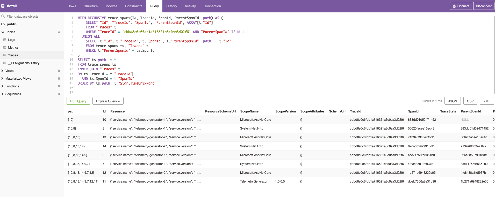

# DOTelL

Developer's OpenTelemetry Lens ([DOTelL](https://en.wiktionary.org/wiki/do_tell)) solves the problem of providing a simple, locally hosted OpenTelemetry back-end.

## Why

Many OpenTelemetry back-ends either require you to use a hosted service (e.g. Honeycomb, Datadog) or one or more resource-heavy local services (e.g. SigNoz) to be able to ingest data from OpenTelemetry signals and view that data. Sometimes all a developer wants is a simplified view over locally emitted telemetry to validate that their applications are instrumented well before deploying them.

DOTelL aims to do the following things:

* Be as resource-light as possible
* Provide OpenTelemetry OTLP gRPC ingestion endpoints for all signal types e.g. traces/metrics/logs
* Provide a simple UI over the data so that developers can easily explore the telemetry being emitted by services they are writing locally

DOTelL is _not_ meant to replace a production-grade OTel backend. It is only meant to be used during local development to provide a simple view over locally emitted telemetry. There is no support for authentication and authorisation which means it should _never_ be deployed to a publicly facing environment.

Because it only implements [OTLP](https://opentelemetry.io/docs/specs/otel/protocol/) gRPC ingestion formats it is trivial to switch your application to a different telemetry backend in deployed environments. It works well either as a direct export target from your applications, or as a target from a locally running instance of the OpenTelemetry Collector.

## Installation

DOTelL is designed to run as a single Docker container with multiple services exposed to the host computer.

### Obtaining DOTelL

To ensure that you have the latest version of DOTelL, run the following command to pull the Docker image

```bash
docker pull ghcr.io/timcallaghan/dotell:latest
```

### Running DOTelL

The DOTelL container houses the following services:

| Service Name                               | Port  | Local access          | Purpose                            |
| ------------------------------------------ | ----- | --------------------- | ---------------------------------- |
| DOTelL gRPC API                            | 4317  | http://localhost:4317 | OTLP signal ingestion endpoint     |
| [pgweb](https://github.com/sosedoff/pgweb) | 5042  | http://localhost:5042 | Simple web-based database explorer |
| [PostgreSQL](https://www.postgresql.org/)  | 5432  | localhost:5432        | Storage of telemetry signal data   |  

The command you choose to run DOTelL depends on which of these services you want to expose on your local computer.

#### Default setup

Expose gRPC API on 4317 and pgweb on 5042

```bash
docker run -p 4317:4317 -p 5042:5042 --name dotell -d ghcr.io/timcallaghan/dotell:latest
```

#### Expose the database

Default setup, and also expose the PostgreSQL database on 5432

```bash
docker run -p 4317:4317 -p 5042:5042 -p 5432:5432 --name dotell -d ghcr.io/timcallaghan/dotell:latest
```

The PostgreSQL database is exposed on the default port of 5432 with:

* user: `postgres`
* password: `password`
* database: `dotell`

#### Different local ports

Expose gRPC API on XXXX, pgweb on YYYY, and PostgreSQL database on ZZZZ

```bash
docker run -p XXXX:4317 -p YYYY:5042 -p ZZZZ:5432 --name dotell -d ghcr.io/timcallaghan/dotell:latest
```

## Usage

### Sending OTel telemetry to DOTelL

Once installed you can configure your local services to send telemetry via gRPC OTLP to the locally exposed port.

By default, you should configure your local services to export gRPC OTLP telemetry to http://localhost:4317.

If you have chosen a different port for the DOTelL API, ensure you use that instead of the default value of `4317`.

### Exploring telemetry data

#### Basic

The included pgweb instance provides a simple, web-based UI over the telemetry data.

1. Open your browser at [http://localhost:5042](http://localhost:5042)
2. Under the `Tables` menu on the left there are options for `Logs`, `Metrics`, and `Traces`
3. Selecting one of these options displays the raw telemetry


#### Advanced

pgweb allows for executing arbitrary SQL against the PostgreSQL database via the `Query` tab. Some of the columns are stored as [`jsonb` data type](https://www.postgresql.org/docs/current/datatype-json.html) so a working understanding of [PostgreSQL JSON functions and operators](https://www.postgresql.org/docs/16/functions-json.html) is helpful when exploring the telemetry data.

Some [example SQL queries](docs/sql-queries.md) have been provided to get you started. The following image shows how to order trace spans using a depth-first approach.


